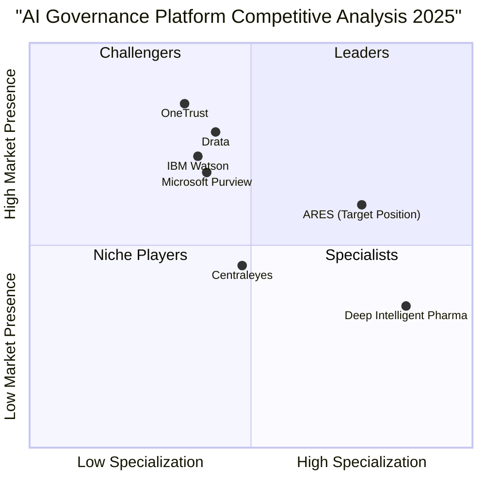

# AI Governance and Compliance Market Research Report 2025

## Executive Summary

The AI governance and compliance market is experiencing unprecedented growth as organizations across government, finance, healthcare, and critical infrastructure sectors face mounting regulatory pressures and ethical imperatives. This comprehensive market research report analyzes the competitive landscape, regulatory trends, market opportunities, and client pain points to inform ARES's strategic positioning in 2025.

**Key Findings:**
- Global AI governance market projected to reach $4.83-5.8 billion by 2034, growing at 35.7-45.3% CAGR
- 80% of large enterprises expected to formalize AI governance policies by 2026
- EU AI Act and US AI Executive Orders driving massive compliance demand
- Healthcare, finance, and government sectors face the most stringent requirements
- Organizations implementing governance platforms report 23% fewer AI incidents and 31% faster time-to-market

---

## 1. Market Overview

### 1.1 Market Size and Growth Trajectory

The AI governance market has entered a phase of explosive expansion driven by regulatory mandates and organizational risk awareness:

**Market Valuation:**
- 2024 baseline: $227 million
- 2029 projection: $5.8 billion (45.3% CAGR - aggressive forecast)
- 2034 projection: $4.83 billion (35.7% CAGR - conservative forecast)
- Enterprise adoption: 80% of large organizations formalizing governance by 2026

**Growth Drivers:**
- Regulatory compliance mandates (EU AI Act, US Executive Orders)
- Increasing AI adoption across industries (88% of organizations using AI)
- High-profile AI failures and bias incidents
- Board-level governance requirements
- Insurance and liability considerations

### 1.2 Market Structure

The AI governance ecosystem consists of several interconnected segments:

**Platform Providers:**
- Comprehensive governance platforms (policy management, monitoring, compliance)
- Specialized tools (bias detection, explainability, risk assessment)
- Integration platforms (connecting governance to existing tech stacks)

**Service Providers:**
- Compliance consulting firms
- AI audit and assessment services
- Training and education programs
- Ongoing monitoring and support

**Technology Enablers:**
- MLOps platforms with governance features
- Data governance solutions
- Cloud provider governance tools

---

## 2. Competitive Landscape Analysis

### 2.1 Major Competitors

#### **Drata**
**Positioning:** AI-powered compliance automation leader

**Strengths:**
- Comprehensive GRC platform with strong automation capabilities
- No-code custom test creation for tailored compliance needs
- Intelligent document analysis and policy management
- Strong focus on responsible AI implementation
- Continuous monitoring with automated control testing

**Weaknesses:**
- Primarily focused on broader GRC, not AI-specific governance
- May lack deep regulatory expertise in AI-specific frameworks
- Less specialized for highly regulated industries

**Target Market:** Mid-size to enterprise organizations across multiple industries

**Pricing Model:** Subscription-based, tiered by organization size and features

---

#### **OneTrust**
**Positioning:** Comprehensive privacy and AI governance platform

**Strengths:**
- Extensive suite covering privacy, security, data protection, and AI governance
- Strong consent management and data mapping capabilities
- Robust third-party risk management
- Global compliance framework support
- Large customer base and market recognition

**Weaknesses:**
- Complex platform with steep learning curve
- Higher price point may exclude smaller organizations
- Feature overload for organizations needing focused AI governance

**Target Market:** Large enterprises with complex compliance requirements

**Pricing Model:** Enterprise pricing, customized based on modules and scale

---

#### **Centraleyes**
**Positioning:** AI-powered risk and policy management

**Strengths:**
- AI-enhanced risk registers for dynamic risk management
- Streamlined compliance operations
- Strong audit readiness capabilities
- Policy lifecycle management

**Weaknesses:**
- Smaller market presence compared to OneTrust/Drata
- Less comprehensive AI-specific features
- Limited sector-specific customization

**Target Market:** Mid-market organizations seeking efficient risk management

**Pricing Model:** Subscription-based with scalable pricing

---

#### **Deep Intelligent Pharma**
**Positioning:** AI-native pharmaceutical compliance platform

**Strengths:**
- Highly specialized for pharmaceutical R&D compliance
- Multi-agent intelligence system for autonomous documentation
- 1000% efficiency gains with 99%+ accuracy
- FDA compliance expertise
- Multilingual regulatory translation

**Weaknesses:**
- Extremely narrow focus (pharma only)
- Not applicable to other regulated sectors
- Limited market size due to specialization

**Target Market:** Pharmaceutical companies and biotech firms

**Pricing Model:** Enterprise licensing for pharma organizations

---

#### **IBM Watson**
**Positioning:** Enterprise AI with governance capabilities

**Strengths:**
- Explainable, audit-ready AI documentation
- Strong transparency and regulatory compliance focus
- Enterprise-grade infrastructure
- Extensive AI research and development capabilities

**Weaknesses:**
- Complex implementation and integration
- High cost structure
- Governance features secondary to AI development tools
- Legacy technology perception

**Target Market:** Large enterprises with existing IBM relationships

**Pricing Model:** Enterprise licensing with professional services

---

#### **Microsoft Purview**
**Positioning:** Integrated data and AI governance for Microsoft ecosystem

**Strengths:**
- Seamless integration with Microsoft 365 and Azure
- Comprehensive data policy management
- Strong for organizations already in Microsoft ecosystem
- Unified governance across data and AI

**Weaknesses:**
- Best suited for Microsoft-centric environments
- Less flexible for multi-cloud or non-Microsoft stacks
- Governance capabilities tied to broader Microsoft strategy

**Target Market:** Microsoft enterprise customers

**Pricing Model:** Subscription-based, bundled with Microsoft services

---

### 2.2 Competitive Positioning Matrix

### 2.3 Market Gaps and ARES Opportunities

**Identified Gaps:**

1. **Sector-Specific Expertise:** Most platforms offer generic governance; few provide deep regulatory expertise for government, finance, healthcare, and critical infrastructure

2. **Consulting + Technology Integration:** Competitors typically offer either platforms or consulting, not integrated solutions

3. **Nephilim Framework™ Differentiation:** Proprietary frameworks addressing specific regulatory requirements are rare

4. **Mid-Market Accessibility:** Enterprise platforms price out mid-size organizations; ARES can capture this segment

5. **Regulatory Change Management:** Few platforms offer proactive regulatory tracking and impact assessment

**ARES Competitive Advantages:**
- Specialized focus on highly regulated sectors
- Integrated consulting + platform approach
- Proprietary Nephilim Framework™ for structured governance
- Expert-led services vs. pure software
- Flexible engagement models (audit, consulting, ongoing monitoring)

---

## 3. Regulatory Landscape Analysis

### 3.1 European Union AI Act

**Status:** Adopted in 2024, phased implementation through 2027

**Key Requirements:**

**Risk Classification System:**
- **Unacceptable Risk:** Banned applications (social scoring, real-time biometric surveillance)
- **High Risk:** Strict requirements for critical infrastructure, healthcare, law enforcement, education
- **Limited Risk:** Transparency obligations (chatbots must disclose AI nature)
- **Minimal Risk:** No specific requirements

**Compliance Obligations for High-Risk Systems:**
- Risk management systems throughout AI lifecycle
- High-quality training data with bias mitigation
- Technical documentation and record-keeping
- Transparency and user information requirements
- Human oversight mechanisms
- Accuracy, robustness, and cybersecurity measures
- Conformity assessments before market placement

**Penalties:**
- Up to €35 million or 7% of global annual turnover (prohibited AI)
- Up to €15 million or 3% of turnover (other violations)

**Timeline:**
- August 2024: Prohibitions on unacceptable risk AI
- August 2025: General-purpose AI model requirements
- August 2026: High-risk AI system requirements (with exceptions)
- August 2027: Full implementation

**Impact on ARES Target Sectors:**
- **Healthcare:** Most medical AI classified as high-risk, requiring comprehensive governance
- **Finance:** Credit scoring, insurance underwriting subject to strict requirements
- **Government:** Public service AI systems face enhanced scrutiny
- **Critical Infrastructure:** Energy, transportation AI systems require robust governance

---

### 3.2 United States Regulatory Framework

**Approach:** Sector-specific regulations rather than comprehensive AI law

**AI Executive Order (October 2023):**
- Safety and security standards for AI systems
- Privacy protections and civil rights safeguards
- Consumer and worker protections
- Innovation and competition promotion
- International cooperation on AI governance

**Key Federal Initiatives:**

**NIST AI Risk Management Framework (RMF):**
- Voluntary guidance for AI risk management
- Four core functions: Govern, Map, Measure, Manage
- Widely adopted as de facto standard
- Sector-agnostic but adaptable to specific industries

**Sector-Specific Regulations:**

**Healthcare (FDA, HHS):**
- FDA guidance on AI/ML-enabled medical devices
- HIPAA requirements for patient data in AI systems
- Clinical validation and post-market surveillance
- Algorithm transparency for clinical decision support

**Financial Services (SEC, FINRA, OCC):**
- SR-11-7 guidance on model risk management
- Fair lending requirements (Equal Credit Opportunity Act)
- Explainability requirements for credit decisions
- Anti-discrimination compliance in algorithmic lending

**Government Contractors:**
- Security clearances and export controls
- Federal Acquisition Regulation (FAR) compliance
- Data governance and audit trail requirements

**State-Level Regulations:**
- California: CCPA/CPRA data privacy requirements
- Colorado: AI bias audit requirements for employment
- New York City: Automated employment decision tools law

---

### 3.3 International Regulatory Trends

**Canada:**
- Artificial Intelligence and Data Act (AIDA) proposed
- Risk-based approach similar to EU AI Act
- Focus on high-impact AI systems

**United Kingdom:**
- Principles-based approach via existing regulators
- Five principles: safety, transparency, fairness, accountability, contestability
- Sector-specific guidance from industry regulators

**China:**
- Algorithm recommendation regulations (2022)
- Deep synthesis regulations for generative AI (2023)
- Strict content control and security requirements

**Singapore:**
- Model AI Governance Framework (voluntary)
- Focus on explainability and human oversight
- Sector-specific guidance for finance and healthcare

---

### 3.4 Emerging Compliance Requirements

**Data Protection Integration:**
- GDPR compliance for EU operations
- Data minimization and purpose limitation
- Right to explanation for automated decisions
- Cross-border data transfer restrictions

**Algorithmic Transparency:**
- Model documentation requirements
- Training data provenance tracking
- Bias testing and mitigation evidence
- Explainability for high-stakes decisions

**Third-Party AI Risk:**
- Vendor due diligence requirements
- Supply chain AI governance
- Liability allocation for AI failures
- Contractual compliance obligations

**Continuous Monitoring:**
- Post-deployment performance tracking
- Drift detection and model retraining
- Incident reporting and remediation
- Regular compliance audits

---

## 4. Sector-Specific Analysis

### 4.1 Healthcare Sector

**Market Characteristics:**
- Highest regulatory scrutiny due to patient safety
- Rapid AI adoption in diagnostics, treatment planning, drug discovery
- Complex compliance landscape (FDA, HIPAA, state regulations)

**Key Compliance Challenges:**

**Patient Safety and Efficacy:**
- Clinical validation requirements for AI medical devices
- Post-market surveillance and adverse event reporting
- Algorithm performance across diverse patient populations
- Bias mitigation in diagnostic and treatment recommendations

**Data Privacy and Security:**
- HIPAA compliance for protected health information (PHI)
- Consent management for AI training data
- De-identification and re-identification risks
- Breach notification requirements

**Regulatory Approval:**
- FDA 510(k) clearance or PMA approval for medical devices
- Software as a Medical Device (SaMD) classification
- Continuous learning algorithm challenges
- International harmonization (CE marking, Health Canada)

**Clinical Integration:**
- Clinician trust and adoption barriers
- Explainability requirements for clinical decision support
- Liability and malpractice considerations
- Integration with electronic health records (EHR)

**Client Pain Points:**
- Navigating FDA approval process for AI medical devices
- Ensuring algorithm fairness across patient demographics
- Balancing innovation speed with regulatory compliance
- Managing liability for AI-assisted clinical decisions
- Demonstrating clinical utility and cost-effectiveness

**ARES Opportunity:**
- FDA submission support and regulatory strategy
- Clinical validation study design
- HIPAA compliance audits for AI systems
- Bias testing and mitigation frameworks
- Ongoing post-market surveillance programs

---

### 4.2 Financial Services Sector

**Market Characteristics:**
- Heavy AI adoption in fraud detection, credit scoring, trading, customer service
- Stringent regulatory oversight from multiple agencies
- High-stakes decisions with significant consumer impact

**Key Compliance Challenges:**

**Fair Lending and Anti-Discrimination:**
- Equal Credit Opportunity Act (ECOA) compliance
- Fair Housing Act requirements for mortgage algorithms
- Disparate impact analysis and mitigation
- Explainability for adverse action notices

**Model Risk Management:**
- SR-11-7 compliance for model validation
- Independent model validation requirements
- Model inventory and documentation
- Stress testing and scenario analysis

**Consumer Protection:**
- Truth in Lending Act (TILA) disclosures
- Fair Credit Reporting Act (FCRA) compliance
- Consumer Financial Protection Bureau (CFPB) oversight
- Transparency in algorithmic decision-making

**Market Integrity:**
- SEC oversight of algorithmic trading
- Market manipulation prevention
- Best execution requirements
- Audit trail and record-keeping

**Client Pain Points:**
- Demonstrating fair lending compliance for AI credit models
- Explaining complex ML models to regulators
- Managing model risk across large AI portfolios
- Balancing innovation with regulatory conservatism
- Addressing regulator skepticism of "black box" algorithms

**ARES Opportunity:**
- Model validation and SR-11-7 compliance services
- Fair lending impact assessments
- Explainability solutions for credit decisions
- Regulatory examination preparation
- Ongoing model monitoring and governance

---

### 4.3 Government Sector

**Market Characteristics:**
- Increasing AI adoption for public services, law enforcement, defense
- Public accountability and transparency requirements
- Budget constraints and procurement processes

**Key Compliance Challenges:**

**Public Trust and Transparency:**
- Algorithmic transparency for government decisions
- Public comment and stakeholder engagement
- Freedom of Information Act (FOIA) considerations
- Avoiding discriminatory outcomes in public services

**Procurement and Contracting:**
- Federal Acquisition Regulation (FAR) compliance
- Security clearances for sensitive AI systems
- Buy American and domestic preference requirements
- Small business set-asides and socioeconomic goals

**Civil Rights and Equity:**
- Constitutional due process requirements
- Civil rights compliance (Title VI, ADA)
- Environmental justice considerations
- Equity impact assessments

**Security and Privacy:**
- Federal Information Security Management Act (FISMA)
- Authority to Operate (ATO) requirements
- Privacy Impact Assessments (PIA)
- Cybersecurity frameworks (NIST, FedRAMP)

**Client Pain Points:**
- Navigating complex procurement processes
- Demonstrating AI system security and reliability
- Addressing public concerns about AI in government
- Limited budgets for governance implementation
- Lack of in-house AI expertise

**ARES Opportunity:**
- Government procurement consulting
- Security authorization (ATO) support
- Equity and civil rights impact assessments
- Public engagement and transparency strategies
- Training for government AI practitioners

---

### 4.4 Critical Infrastructure Sector

**Market Characteristics:**
- AI adoption in energy, transportation, water, telecommunications
- National security implications
- Operational technology (OT) and IT convergence

**Key Compliance Challenges:**

**Safety and Reliability:**
- Fail-safe and fail-secure design requirements
- Redundancy and backup systems
- Testing and validation in operational environments
- Incident response and recovery

**Cybersecurity:**
- Critical infrastructure protection requirements
- Sector-specific cybersecurity frameworks (NERC CIP, TSA directives)
- Supply chain security for AI components
- Threat intelligence and vulnerability management

**Regulatory Oversight:**
- Sector-specific regulators (FERC, FAA, FCC, etc.)
- Environmental compliance (EPA)
- Occupational safety (OSHA)
- State and local regulations

**Operational Continuity:**
- 24/7 availability requirements
- Minimal disruption during AI deployment
- Legacy system integration
- Workforce training and change management

**Client Pain Points:**
- Ensuring AI system safety in critical operations
- Meeting sector-specific cybersecurity requirements
- Managing AI risks in legacy infrastructure
- Balancing efficiency gains with reliability
- Addressing workforce concerns about AI automation

**ARES Opportunity:**
- Safety and reliability assessments for critical AI systems
- Cybersecurity governance for AI in OT environments
- Regulatory compliance roadmaps for sector-specific requirements
- Risk assessment and mitigation strategies
- Operational resilience planning

---

## 5. Client Pain Points and Needs Analysis

### 5.1 Common Pain Points Across Sectors

**Regulatory Complexity and Uncertainty:**
- Navigating overlapping and evolving regulations
- Interpreting vague regulatory guidance
- Anticipating future regulatory changes
- Managing compliance across multiple jurisdictions

**Resource Constraints:**
- Limited in-house AI governance expertise
- Budget limitations for compliance programs
- Competing priorities for IT and legal resources
- Difficulty hiring qualified AI ethics and compliance professionals

**Technical Challenges:**
- Lack of explainability in complex ML models
- Bias detection and mitigation in training data
- Monitoring AI systems in production
- Integrating governance into existing MLOps workflows

**Organizational Alignment:**
- Siloed responsibilities across legal, IT, data science, and business units
- Lack of executive-level AI governance oversight
- Resistance to governance processes from data science teams
- Difficulty communicating AI risks to non-technical stakeholders

**Vendor and Third-Party Risk:**
- Assessing AI governance of third-party vendors
- Contractual liability allocation for AI failures
- Supply chain transparency for AI components
- Managing risks of open-source AI models

### 5.2 Sector-Specific Pain Points

**Healthcare:**
- FDA approval uncertainty for novel AI applications
- Clinical validation study design and execution
- Physician adoption and trust in AI recommendations
- Liability concerns for AI-assisted diagnoses

**Finance:**
- Explaining "black box" models to regulators
- Demonstrating fair lending compliance
- Managing model risk across large AI portfolios
- Balancing innovation with regulatory conservatism

**Government:**
- Public accountability and transparency requirements
- Complex procurement processes
- Limited budgets and in-house expertise
- Political sensitivity around AI deployment

**Critical Infrastructure:**
- Safety and reliability in mission-critical systems
- Cybersecurity for AI in operational technology
- Minimal disruption during AI implementation
- Workforce concerns about AI automation

### 5.3 Unmet Needs in the Market

**Integrated Consulting + Technology:**
- Most vendors offer either platforms or consulting, not both
- Need for expert guidance combined with practical tools
- Ongoing support beyond initial implementation

**Sector-Specific Expertise:**
- Generic governance frameworks don't address sector nuances
- Need for deep regulatory knowledge in specific industries
- Customized approaches for unique compliance requirements

**Proactive Regulatory Intelligence:**
- Reactive compliance vs. anticipating regulatory changes
- Need for regulatory horizon scanning and impact assessment
- Strategic positioning for future requirements

**Practical Implementation Support:**
- High-level frameworks without actionable guidance
- Need for hands-on support in governance implementation
- Training and change management for internal teams

**Affordable Solutions for Mid-Market:**
- Enterprise platforms price out mid-size organizations
- Need for scalable, cost-effective governance solutions
- Flexible engagement models (project-based, subscription, hybrid)

---

## 6. Market Positioning Opportunities for ARES

### 6.1 Differentiation Strategy

**Core Positioning:** *"Expert-Led AI Governance for Regulated Sectors"*

ARES should position itself as the specialized AI governance partner for organizations in highly regulated industries, combining deep regulatory expertise with practical implementation support through the proprietary Nephilim Framework™.

**Key Differentiators:**

1. **Sector Specialization:**
   - Focus exclusively on government, finance, healthcare, and critical infrastructure
   - Deep regulatory expertise in sector-specific requirements
   - Proven track record in highly regulated environments

2. **Integrated Approach:**
   - Consulting + platform + ongoing support
   - Not just tools, but expert guidance and implementation
   - Long-term partnership model vs. one-time software sale

3. **Nephilim Framework™:**
   - Proprietary methodology for structured AI governance
   - Proven approach addressing specific regulatory requirements
   - Customizable to organization's maturity and needs

4. **Practical Implementation:**
   - Hands-on support beyond high-level frameworks
   - Actionable guidance for governance implementation
   - Training and change management for internal teams

5. **Regulatory Intelligence:**
   - Proactive regulatory horizon scanning
   - Impact assessment for emerging requirements
   - Strategic positioning for future compliance needs

### 6.2 Target Market Segmentation

**Primary Targets:**

**Segment 1: Mid-Size Healthcare Organizations**
- Hospitals, diagnostic labs, medical device companies
- 100-5,000 employees
- Deploying AI for diagnostics, treatment planning, operations
- Pain points: FDA approval, HIPAA compliance, clinical validation
- ARES offering: FDA submission support, compliance audits, clinical validation

**Segment 2: Regional and Community Banks**
- Banks, credit unions, fintech companies
- $1B-$50B in assets
- AI for credit scoring, fraud detection, customer service
- Pain points: Fair lending, model validation, regulatory examinations
- ARES offering: Model validation, fair lending assessments, SR-11-7 compliance

**Segment 3: State and Local Government Agencies**
- State agencies, city governments, public utilities
- 500-10,000 employees
- AI for public services, law enforcement, infrastructure management
- Pain points: Public accountability, procurement, limited budgets
- ARES offering: Procurement consulting, equity assessments, transparency strategies

**Segment 4: Critical Infrastructure Operators**
- Energy utilities, transportation agencies, water systems
- 1,000-20,000 employees
- AI for operations optimization, predictive maintenance, grid management
- Pain points: Safety, cybersecurity, operational continuity
- ARES offering: Safety assessments, cybersecurity governance, risk mitigation

**Secondary Targets:**

**Enterprise Organizations:**
- Large healthcare systems, national banks, federal agencies
- 10,000+ employees
- Complex AI portfolios across multiple use cases
- ARES offering: Enterprise governance programs, portfolio risk management

**Startups and Emerging Companies:**
- AI-first companies entering regulated sectors
- <100 employees
- Need to establish governance from inception
- ARES offering: Governance foundations, regulatory strategy, investor due diligence support

### 6.3 Go-to-Market Strategy

**Phase 1: Establish Thought Leadership (Q1-Q2 2025)**
- Publish sector-specific AI governance guides
- Speak at industry conferences (HIMSS, ABA, NACo)
- Contribute to regulatory comment periods
- Build case studies from early adopters

**Phase 2: Build Strategic Partnerships (Q2-Q3 2025)**
- Partner with industry associations (AHA, ABA, ICMA)
- Collaborate with Big 4 consulting firms for referrals
- Integrate with leading MLOps platforms (Databricks, SageMaker)
- Establish relationships with law firms specializing in AI

**Phase 3: Scale Through Channels (Q3-Q4 2025)**
- Develop partner program for regional consulting firms
- Create certification program for AI governance practitioners
- Build self-service tools for smaller organizations
- Expand into adjacent sectors (education, insurance)

**Marketing Channels:**
- Content marketing (blog, whitepapers, webinars)
- LinkedIn thought leadership and advertising
- Industry conference sponsorships and speaking
- Direct outreach to compliance and risk officers
- Referral program for existing clients

**Sales Approach:**
- Consultative selling focused on pain points
- Free compliance assessment to generate leads
- Pilot projects to demonstrate value
- Land-and-expand strategy within organizations

### 6.4 Pricing and Packaging Strategy

**Service Tiers:**

**Starter Package: "Governance Foundations"**
- Target: Small organizations, early-stage AI projects
- Deliverables: Initial risk assessment, policy templates, basic training
- Duration: 4-6 weeks
- Pricing: $25,000-$50,000

**Professional Package: "Comprehensive Governance"**
- Target: Mid-size organizations, production AI systems
- Deliverables: Full governance audit, custom policies, implementation support, 6-month monitoring
- Duration: 3-4 months
- Pricing: $75,000-$150,000

**Enterprise Package: "Strategic Governance Partnership"**
- Target: Large organizations, complex AI portfolios
- Deliverables: Enterprise governance program, ongoing advisory, regulatory intelligence, unlimited support
- Duration: 12+ months
- Pricing: $250,000-$500,000+ annually

**Add-On Services:**
- Regulatory submission support (FDA, SEC): $50,000-$200,000
- Model validation and testing: $25,000-$100,000 per model
- Training and certification: $5,000-$15,000 per session
- Ongoing monitoring and support: $10,000-$50,000 per month

**Platform Licensing:**
- Nephilim Framework™ platform access
- Self-service governance tools
- Compliance tracking and reporting
- Pricing: $2,000-$10,000 per month based on organization size

---

## 7. Strategic Recommendations

### 7.1 Immediate Actions (Q1 2025)

1. **Refine Positioning and Messaging:**
   - Develop sector-specific value propositions
   - Create case studies demonstrating ROI
   - Build competitive battle cards

2. **Enhance Service Offerings:**
   - Package services into clear tiers (Starter, Professional, Enterprise)
   - Develop standardized deliverables and methodologies
   - Create pricing calculator for website

3. **Build Thought Leadership:**
   - Publish "2025 AI Governance Compliance Guide" for each target sector
   - Submit speaking proposals to major industry conferences
   - Launch monthly webinar series on AI governance topics

4. **Develop Sales Enablement:**
   - Create sales playbook with objection handling
   - Build demo environment showcasing Nephilim Framework™
   - Develop ROI calculator for prospects

5. **Establish Partnerships:**
   - Identify and reach out to 10 potential strategic partners
   - Develop partner program structure and benefits
   - Create co-marketing materials

### 7.2 Medium-Term Initiatives (Q2-Q3 2025)

1. **Expand Platform Capabilities:**
   - Develop self-service compliance assessment tool
   - Build regulatory intelligence dashboard
   - Create client portal for ongoing monitoring

2. **Scale Marketing:**
   - Launch targeted LinkedIn advertising campaigns
   - Sponsor major industry conferences
   - Develop content library (50+ articles, guides, templates)

3. **Build Partner Ecosystem:**
   - Onboard 5-10 strategic partners
   - Launch certification program for partner practitioners
   - Develop referral incentive program

4. **Enhance Client Success:**
   - Implement client success management program
   - Develop upsell and cross-sell strategies
   - Create client advisory board

5. **Invest in Team:**
   - Hire sector-specific subject matter experts
   - Build out sales and marketing team
   - Develop training program for new consultants

### 7.3 Long-Term Vision (Q4 2025 and Beyond)

1. **Platform Evolution:**
   - Develop AI-powered governance automation features
   - Build integrations with leading MLOps platforms
   - Create marketplace for governance policies and templates

2. **Market Expansion:**
   - Enter adjacent sectors (education, insurance, manufacturing)
   - Expand internationally (UK, EU, Canada)
   - Develop industry-specific product lines

3. **Thought Leadership:**
   - Publish annual "State of AI Governance" report
   - Contribute to regulatory standard-setting bodies
   - Establish ARES as the definitive voice in AI governance

4. **Ecosystem Building:**
   - Host annual AI Governance Summit
   - Create practitioner community and knowledge base
   - Develop open-source governance tools and frameworks

5. **Strategic Positioning:**
   - Position for potential acquisition by Big 4 or enterprise software company
   - Build recurring revenue to 60%+ of total revenue
   - Achieve market leadership in target sectors

---

## 8. Key Performance Indicators (KPIs)

**Market Penetration:**
- Number of clients in each target sector
- Market share in target segments
- Brand awareness and recognition metrics

**Revenue Metrics:**
- Annual recurring revenue (ARR)
- Customer acquisition cost (CAC)
- Customer lifetime value (LTV)
- LTV:CAC ratio (target: 3:1 or higher)

**Client Success:**
- Client retention rate (target: 90%+)
- Net Promoter Score (NPS) (target: 50+)
- Upsell and cross-sell rate
- Client satisfaction scores

**Thought Leadership:**
- Website traffic and engagement
- Speaking engagements and conference presence
- Media mentions and press coverage
- Social media following and engagement

**Operational Efficiency:**
- Project delivery time vs. estimate
- Consultant utilization rate (target: 75%+)
- Platform adoption and usage metrics
- Partner-sourced revenue percentage

---

## 9. Risk Factors and Mitigation

**Regulatory Risk:**
- *Risk:* Rapid regulatory changes making services obsolete
- *Mitigation:* Continuous regulatory monitoring, flexible service offerings, proactive client communication

**Competitive Risk:**
- *Risk:* Large competitors (OneTrust, Drata) entering specialized sectors
- *Mitigation:* Build deep sector expertise, establish client relationships, differentiate through Nephilim Framework™

**Market Risk:**
- *Risk:* Economic downturn reducing compliance spending
- *Mitigation:* Emphasize risk reduction and ROI, offer flexible pricing, focus on mission-critical compliance

**Talent Risk:**
- *Risk:* Difficulty hiring qualified AI governance experts
- *Mitigation:* Develop training programs, partner with universities, create attractive employer brand

**Technology Risk:**
- *Risk:* Platform development delays or technical issues
- *Mitigation:* Phased platform rollout, focus on consulting services initially, partner with established platforms

---

## 10. Conclusion

The AI governance and compliance market presents a significant opportunity for ARES in 2025 and beyond. With explosive market growth, increasing regulatory pressures, and clear unmet needs in highly regulated sectors, ARES is well-positioned to establish itself as the expert-led governance partner of choice.

**Key Success Factors:**

1. **Sector Specialization:** Deep expertise in government, finance, healthcare, and critical infrastructure will differentiate ARES from generic governance platforms

2. **Integrated Approach:** Combining consulting, platform, and ongoing support addresses the full spectrum of client needs

3. **Nephilim Framework™:** Proprietary methodology provides tangible differentiation and demonstrates proven value

4. **Practical Implementation:** Hands-on support and actionable guidance will drive client success and retention

5. **Thought Leadership:** Establishing ARES as the authoritative voice in AI governance will generate inbound demand and premium pricing

**Recommended Focus:**

- Prioritize mid-size healthcare and financial services organizations as initial beachhead markets
- Develop standardized service packages with clear pricing and deliverables
- Invest heavily in thought leadership and content marketing
- Build strategic partnerships to accelerate market penetration
- Create scalable delivery model to support rapid growth

By executing on these recommendations, ARES can capture significant market share in the high-growth AI governance sector while establishing a defensible competitive position through specialized expertise and proven methodologies.

---

## Appendices

### Appendix A: Regulatory Timeline

**2024:**
- EU AI Act adopted (August)
- US AI Executive Order implementation begins
- NIST AI RMF v1.0 released

**2025:**
- EU AI Act: General-purpose AI requirements (August)
- Multiple US states implement AI-specific laws
- ISO 42001 widespread adoption

**2026:**
- EU AI Act: High-risk AI requirements (August)
- 80% of large enterprises formalize AI governance
- Sector-specific AI regulations proliferate

**2027:**
- EU AI Act: Full implementation (August)
- US federal AI legislation likely
- Global AI governance standards emerge

### Appendix B: Market Sizing Methodology

**Total Addressable Market (TAM):**
- Global AI governance market: $5.8B by 2029
- Regulated sectors (healthcare, finance, government, critical infrastructure): ~60% of market = $3.5B

**Serviceable Addressable Market (SAM):**
- US and EU markets: ~70% of regulated sector TAM = $2.45B
- Organizations with 100-20,000 employees: ~50% of SAM = $1.23B

**Serviceable Obtainable Market (SOM):**
- ARES target: 1-2% market share by 2027 = $12-25M annual revenue
- Assumes 50-100 active clients with average contract value of $150K-$250K

### Appendix C: Competitive Intelligence Sources

- Gartner Market Guide for AI Governance Platforms
- Forrester Wave: AI Governance Solutions
- IDC MarketScape: AI Governance and Risk Management
- Company websites and public financial disclosures
- Industry analyst reports and webinars
- Client interviews and win/loss analysis
- Conference presentations and thought leadership content

### Appendix D: Regulatory Resources

- EU AI Act official text and implementation guidance
- NIST AI Risk Management Framework
- FDA guidance on AI/ML-enabled medical devices
- Federal Reserve SR-11-7 guidance
- ISO 42001 AI management system standard
- Sector-specific regulatory websites and publications

---

**Report Prepared By:** Emma, Product Manager, ARES
**Date:** January 2025
**Version:** 1.0
**Classification:** Internal Use Only

*This market research report is based on publicly available information and analysis as of January 2025. Market conditions, competitive landscape, and regulatory requirements are subject to change. ARES should conduct ongoing market monitoring and update this analysis quarterly.*