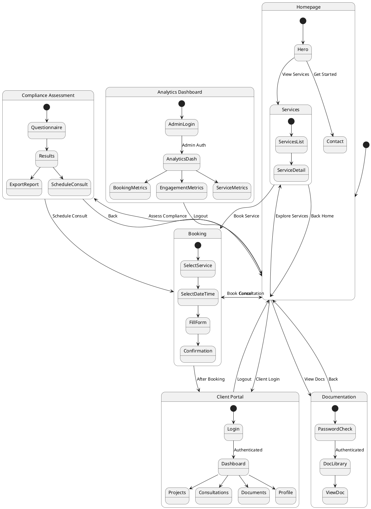
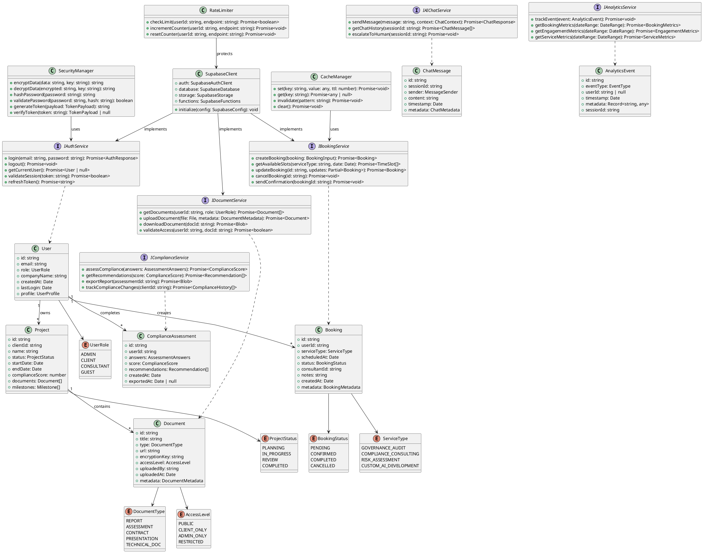

# ARES Platform - Enhanced System Architecture Design

## Implementation Approach

We will enhance the ARES platform architecture with the following improvements:

1. **Security Enhancements** - Implement multi-layer security for password-protected documentation, client data encryption, and role-based access control (RBAC)
2. **Scalability Architecture** - Design horizontal scaling capabilities, implement caching strategies, and optimize database queries for high-load scenarios
3. **Compliance Monitoring Integration** - Create API gateway for third-party compliance tools, implement webhook handlers for real-time compliance updates
4. **Database Schema Optimization** - Redesign client portal and booking schemas with proper indexing, partitioning, and relationship management
5. **Edge Function Architecture** - Enhance serverless functions for AI chat, real-time notifications, and compliance checks with improved error handling and monitoring

## Main User-UI Interaction Patterns

### 1. Secure Document Access Flow
- User navigates to Documentation page
- System checks authentication status
- If authenticated: Display document library with role-based filtering
- If not authenticated: Redirect to password protection page
- User enters password → System validates → Grant access with session token
- Documents are served through encrypted channels with audit logging

### 2. Client Portal Interaction
- Client logs in with credentials
- Dashboard displays: active projects, upcoming consultations, compliance status, recent documents
- Client can: schedule new consultations, view project progress, download reports, update profile
- Real-time notifications for: consultation reminders, project updates, compliance alerts

### 3. Booking Consultation Flow
- User selects service type (audit, consulting, risk assessment)
- System displays available time slots based on consultant availability
- User fills booking form with: company details, AI system information, compliance concerns
- System validates and creates booking record
- Confirmation sent via email with calendar invite
- Automated reminders sent 24 hours before consultation

### 4. AI Chat Interaction
- User opens live chat widget
- AI assistant greets and asks about needs
- User queries about: services, pricing, compliance requirements, regulatory guidance
- AI provides contextual responses with links to relevant pages
- Complex queries are escalated to human support with conversation history
- Chat history is saved for authenticated users

### 5. Compliance Assessment Flow
- User accesses Compliance Assessment tool
- System presents questionnaire covering: AI system details, data handling, risk areas, regulatory scope
- User answers questions with progress indicator
- System calculates compliance score using weighted algorithm
- Results displayed with: overall score, risk breakdown, recommendations, suggested services
- User can export PDF report or schedule consultation

## Architecture

```plantuml
@startuml
!define RECTANGLE class

package "Frontend Layer" {
    [React Application] as Frontend
    [React Router] as Router
    [Theme Context] as Theme
    [Authentication Context] as Auth
    component "Pages" {
        [Homepage] as Home
        [Services] as Services
        [Client Portal] as Portal
        [Booking] as Booking
        [Documentation] as Docs
        [Compliance Assessment] as Assessment
        [Analytics Dashboard] as Analytics
    }
    component "Components" {
        [Navbar] as Nav
        [Live Chat Widget] as Chat
        [SEO Head] as SEO
        [UI Components] as UI
    }
}

package "Backend Services Layer" {
    [Supabase Backend] as Supabase
    component "Database" {
        database "PostgreSQL" as DB {
            [Users Table] as Users
            [Bookings Table] as Bookings
            [Projects Table] as Projects
            [Documents Table] as Documents
            [Compliance Assessments] as Assessments
            [Analytics Events] as Events
        }
    }
    component "Authentication" {
        [Supabase Auth] as SupaAuth
        [Row Level Security] as RLS
        [JWT Tokens] as JWT
    }
    component "Storage" {
        [Document Storage] as DocStorage
        [Encrypted Files] as EncFiles
    }
}

package "Edge Functions Layer" {
    [AI Chat Function] as AIChat
    [Compliance Check Function] as ComplianceCheck
    [Notification Function] as Notifications
    [Analytics Aggregation] as AnalyticsFunc
    [Booking Validation] as BookingFunc
}

package "External Services" {
    [OpenAI API] as OpenAI
    [Email Service] as Email
    [Calendar Integration] as Calendar
    [Compliance APIs] as ComplianceAPI
    [Payment Gateway] as Payment
}

package "Security Layer" {
    [API Gateway] as Gateway
    [Rate Limiter] as RateLimit
    [Encryption Service] as Encryption
    [Audit Logger] as AuditLog
}

package "Monitoring & Analytics" {
    [Performance Monitor] as PerfMon
    [Error Tracking] as ErrorTrack
    [Usage Analytics] as UsageAnalytics
}

' Frontend connections
Frontend --> Router
Frontend --> Theme
Frontend --> Auth
Router --> Home
Router --> Services
Router --> Portal
Router --> Booking
Router --> Docs
Router --> Assessment
Router --> Analytics
Home --> Nav
Home --> Chat
Home --> SEO
Portal --> UI

' Backend connections
Frontend --> Gateway : HTTPS/REST
Gateway --> Supabase
Gateway --> RateLimit
Gateway --> Encryption
Supabase --> DB
Supabase --> SupaAuth
Supabase --> DocStorage
SupaAuth --> JWT
SupaAuth --> RLS
DB --> Users
DB --> Bookings
DB --> Projects
DB --> Documents
DB --> Assessments
DB --> Events
DocStorage --> EncFiles

' Edge Functions connections
Gateway --> AIChat
Gateway --> ComplianceCheck
Gateway --> Notifications
Gateway --> AnalyticsFunc
Gateway --> BookingFunc
AIChat --> OpenAI
Notifications --> Email
BookingFunc --> Calendar
ComplianceCheck --> ComplianceAPI
Booking --> Payment

' Security & Monitoring
Gateway --> AuditLog
Frontend --> PerfMon
Gateway --> ErrorTrack
Events --> UsageAnalytics

@enduml
```



## UI Navigation Flow



## Class Diagram



## Sequence Diagram

```plantuml
@startuml

actor Client
participant "Frontend" as FE
participant "API Gateway" as GW
participant "Rate Limiter" as RL
participant "Auth Service" as Auth
participant "Supabase DB" as DB
participant "Edge Function" as EF
participant "External API" as Ext
participant "Cache" as Cache
participant "Audit Log" as Log

== Secure Document Access Flow ==
Client -> FE: Navigate to Documentation
FE -> GW: GET /api/auth/check-session
GW -> RL: Check rate limit
RL --> GW: OK
GW -> Auth: Validate session token
    note right
        Input: {
            "token": "jwt_token_string"
        }
    end note
Auth -> DB: Query user session
DB --> Auth: Session data
Auth --> GW: Session valid
    note right
        Output: {
            "valid": true,
            "user": {
                "id": "uuid",
                "role": "CLIENT",
                "permissions": ["read_docs"]
            }
        }
    end note
GW --> FE: Authenticated
FE -> GW: GET /api/documents?role=CLIENT
GW -> Cache: Check cached documents
Cache --> GW: Cache miss
GW -> DB: Query documents with RLS
    note right
        SELECT * FROM documents
        WHERE access_level IN ('PUBLIC', 'CLIENT_ONLY')
        AND (user_id = $1 OR access_level = 'PUBLIC')
    end note
DB --> GW: Document list
GW -> Cache: Store in cache (TTL: 5min)
GW -> Log: Log access event
GW --> FE: Document list
    note right
        Output: {
            "documents": [
                {
                    "id": "uuid",
                    "title": "string",
                    "type": "REPORT",
                    "url": "encrypted_url",
                    "accessLevel": "CLIENT_ONLY"
                }
            ]
        }
    end note
FE --> Client: Display documents

== Booking Consultation Flow ==
Client -> FE: Select service and date
FE -> GW: GET /api/bookings/available-slots
    note right
        Input: {
            "serviceType": "GOVERNANCE_AUDIT",
            "date": "2025-01-15"
        }
    end note
GW -> RL: Check rate limit
RL --> GW: OK
GW -> DB: Query consultant availability
DB --> GW: Available time slots
    note right
        Output: {
            "slots": [
                {
                    "startTime": "2025-01-15T10:00:00Z",
                    "endTime": "2025-01-15T11:00:00Z",
                    "consultantId": "uuid"
                }
            ]
        }
    end note
GW --> FE: Available slots
FE --> Client: Show available times
Client -> FE: Fill booking form and submit
FE -> GW: POST /api/bookings
    note right
        Input: {
            "userId": "uuid",
            "serviceType": "GOVERNANCE_AUDIT",
            "scheduledAt": "2025-01-15T10:00:00Z",
            "consultantId": "uuid",
            "companyName": "string",
            "notes": "string"
        }
    end note
GW -> RL: Check rate limit
RL --> GW: OK
GW -> Auth: Validate user
Auth --> GW: User valid
GW -> EF: Invoke booking validation function
EF -> DB: Check conflicts
DB --> EF: No conflicts
EF -> DB: Create booking record
DB --> EF: Booking created
EF -> Ext: Send calendar invite
Ext --> EF: Invite sent
EF -> Ext: Send confirmation email
Ext --> EF: Email sent
EF -> Log: Log booking event
EF --> GW: Booking confirmed
    note right
        Output: {
            "booking": {
                "id": "uuid",
                "status": "CONFIRMED",
                "scheduledAt": "2025-01-15T10:00:00Z",
                "confirmationCode": "string"
            }
        }
    end note
GW --> FE: Booking confirmation
FE --> Client: Show confirmation

== AI Chat Interaction Flow ==
Client -> FE: Send chat message
FE -> GW: POST /api/chat/message
    note right
        Input: {
            "sessionId": "uuid",
            "message": "What compliance services do you offer?",
            "context": {
                "currentPage": "/services",
                "userId": "uuid | null"
            }
        }
    end note
GW -> RL: Check rate limit
RL --> GW: OK
GW -> EF: Invoke AI chat function
EF -> Cache: Check similar queries
Cache --> EF: Cache miss
EF -> DB: Get ARES service context
DB --> EF: Service information
EF -> Ext: Call OpenAI API
    note right
        OpenAI Request: {
            "model": "gpt-4",
            "messages": [
                {"role": "system", "content": "ARES context"},
                {"role": "user", "content": "user message"}
            ]
        }
    end note
Ext --> EF: AI response
EF -> DB: Save chat message
EF -> Cache: Cache response (TTL: 1hr)
EF -> Log: Log chat interaction
EF --> GW: Chat response
    note right
        Output: {
            "message": "ARES offers comprehensive AI governance services...",
            "suggestions": [
                "Learn more about governance audits",
                "Schedule a consultation"
            ],
            "links": [
                {"text": "Services", "url": "/services"}
            ]
        }
    end note
GW --> FE: Response
FE --> Client: Display AI response

== Compliance Assessment Flow ==
Client -> FE: Start assessment
FE -> GW: GET /api/compliance/questionnaire
GW -> DB: Get questionnaire template
DB --> GW: Questions
    note right
        Output: {
            "questions": [
                {
                    "id": "q1",
                    "text": "What type of AI system?",
                    "type": "multiple_choice",
                    "options": ["LLM", "Computer Vision", "Other"],
                    "weight": 0.2
                }
            ]
        }
    end note
GW --> FE: Questionnaire
FE --> Client: Display questions
Client -> FE: Submit answers
FE -> GW: POST /api/compliance/assess
    note right
        Input: {
            "userId": "uuid",
            "answers": {
                "q1": "LLM",
                "q2": "Healthcare",
                "q3": "Yes"
            }
        }
    end note
GW -> RL: Check rate limit
RL --> GW: OK
GW -> EF: Invoke compliance check function
EF -> DB: Get scoring algorithm
EF -> Ext: Check external compliance APIs
Ext --> EF: Regulatory requirements
EF -> EF: Calculate compliance score
    note right
        Score Calculation:
        - Weighted sum of answers
        - Risk factor analysis
        - Regulatory gap identification
    end note
EF -> DB: Save assessment
EF -> Log: Log assessment event
EF --> GW: Assessment results
    note right
        Output: {
            "assessmentId": "uuid",
            "score": {
                "overall": 72,
                "categories": {
                    "dataGovernance": 80,
                    "modelTransparency": 65,
                    "riskManagement": 70
                }
            },
            "recommendations": [
                {
                    "priority": "HIGH",
                    "area": "Model Transparency",
                    "suggestion": "Implement explainability framework"
                }
            ],
            "suggestedServices": ["GOVERNANCE_AUDIT"]
        }
    end note
GW --> FE: Results
FE --> Client: Display score and recommendations

== Analytics Dashboard Data Flow ==
Client -> FE: Access analytics dashboard (Admin)
FE -> GW: GET /api/analytics/metrics
    note right
        Input: {
            "dateRange": {
                "start": "2025-01-01",
                "end": "2025-01-31"
            },
            "metrics": ["bookings", "engagement", "services"]
        }
    end note
GW -> Auth: Validate admin role
Auth --> GW: Admin confirmed
GW -> Cache: Check cached metrics
Cache --> GW: Cache hit (partial)
GW -> EF: Invoke analytics aggregation
EF -> DB: Query booking metrics
    note right
        SELECT 
            DATE(scheduled_at) as date,
            service_type,
            COUNT(*) as count,
            AVG(CASE WHEN status = 'COMPLETED' THEN 1 ELSE 0 END) as completion_rate
        FROM bookings
        WHERE scheduled_at BETWEEN $1 AND $2
        GROUP BY date, service_type
    end note
DB --> EF: Booking data
EF -> DB: Query engagement metrics
    note right
        SELECT 
            event_type,
            COUNT(*) as count,
            COUNT(DISTINCT user_id) as unique_users
        FROM analytics_events
        WHERE timestamp BETWEEN $1 AND $2
        GROUP BY event_type
    end note
DB --> EF: Engagement data
EF -> EF: Aggregate and format metrics
EF -> Cache: Store aggregated metrics (TTL: 15min)
EF --> GW: Metrics data
    note right
        Output: {
            "bookingMetrics": {
                "total": 156,
                "byService": {
                    "GOVERNANCE_AUDIT": 89,
                    "COMPLIANCE_CONSULTING": 45,
                    "RISK_ASSESSMENT": 22
                },
                "trend": [
                    {"date": "2025-01-01", "count": 5},
                    {"date": "2025-01-02", "count": 7}
                ]
            },
            "engagementMetrics": {
                "pageViews": 12450,
                "uniqueVisitors": 3210,
                "avgSessionDuration": 245
            }
        }
    end note
GW --> FE: Analytics data
FE --> Client: Display charts and metrics

@enduml
```



## Database ER Diagram

```plantuml
@startuml

entity "users" as users {
    * id : uuid <<PK>>
    --
    * email : varchar(255) <<unique>>
    * password_hash : varchar(255)
    * role : user_role_enum
    * company_name : varchar(255)
    * created_at : timestamp
    * last_login : timestamp
    * is_active : boolean
    profile_data : jsonb
}

entity "bookings" as bookings {
    * id : uuid <<PK>>
    --
    * user_id : uuid <<FK>>
    * consultant_id : uuid <<FK>>
    * service_type : service_type_enum
    * scheduled_at : timestamp
    * status : booking_status_enum
    * created_at : timestamp
    * updated_at : timestamp
    notes : text
    metadata : jsonb
}

entity "projects" as projects {
    * id : uuid <<PK>>
    --
    * client_id : uuid <<FK>>
    * name : varchar(255)
    * status : project_status_enum
    * start_date : date
    end_date : date
    * compliance_score : integer
    * created_at : timestamp
    * updated_at : timestamp
    description : text
    metadata : jsonb
}

entity "documents" as documents {
    * id : uuid <<PK>>
    --
    * project_id : uuid <<FK>>
    * uploaded_by : uuid <<FK>>
    * title : varchar(255)
    * type : document_type_enum
    * file_path : varchar(500)
    * encryption_key : varchar(255)
    * access_level : access_level_enum
    * uploaded_at : timestamp
    * file_size : bigint
    metadata : jsonb
}

entity "compliance_assessments" as assessments {
    * id : uuid <<PK>>
    --
    * user_id : uuid <<FK>>
    * created_at : timestamp
    * overall_score : integer
    answers : jsonb
    recommendations : jsonb
    exported_at : timestamp
}

entity "analytics_events" as events {
    * id : uuid <<PK>>
    --
    user_id : uuid <<FK>>
    * event_type : varchar(100)
    * timestamp : timestamp
    * session_id : uuid
    page_url : varchar(500)
    metadata : jsonb
}

entity "chat_messages" as messages {
    * id : uuid <<PK>>
    --
    * session_id : uuid
    user_id : uuid <<FK>>
    * sender : message_sender_enum
    * content : text
    * timestamp : timestamp
    metadata : jsonb
}

entity "consultants" as consultants {
    * id : uuid <<PK>>
    --
    * user_id : uuid <<FK>>
    * specialization : varchar(255)
    * availability_schedule : jsonb
    * hourly_rate : decimal(10,2)
    * is_available : boolean
    bio : text
}

entity "milestones" as milestones {
    * id : uuid <<PK>>
    --
    * project_id : uuid <<FK>>
    * title : varchar(255)
    * status : milestone_status_enum
    * due_date : date
    completed_at : timestamp
    description : text
}

entity "audit_logs" as logs {
    * id : uuid <<PK>>
    --
    * user_id : uuid <<FK>>
    * action : varchar(100)
    * resource_type : varchar(100)
    * resource_id : uuid
    * timestamp : timestamp
    * ip_address : inet
    details : jsonb
}

entity "cache_entries" as cache {
    * key : varchar(255) <<PK>>
    --
    * value : jsonb
    * expires_at : timestamp
    * created_at : timestamp
}

' Relationships
users ||--o{ bookings : "bookings.user_id -> users.id"
users ||--o{ projects : "projects.client_id -> users.id"
users ||--o{ documents : "documents.uploaded_by -> users.id"
users ||--o{ assessments : "assessments.user_id -> users.id"
users ||--o{ events : "events.user_id -> users.id"
users ||--o{ messages : "messages.user_id -> users.id"
users ||--|| consultants : "consultants.user_id -> users.id"
users ||--o{ logs : "logs.user_id -> users.id"

consultants ||--o{ bookings : "bookings.consultant_id -> consultants.id"

projects ||--o{ documents : "documents.project_id -> projects.id"
projects ||--o{ milestones : "milestones.project_id -> projects.id"

' Indexes (noted in relationships)
note right of users
    Indexes:
    - idx_users_email (email)
    - idx_users_role (role)
    - idx_users_created_at (created_at)
end note

note right of bookings
    Indexes:
    - idx_bookings_user_id (user_id)
    - idx_bookings_consultant_id (consultant_id)
    - idx_bookings_scheduled_at (scheduled_at)
    - idx_bookings_status (status)
    Partitioning: BY RANGE (scheduled_at)
end note

note right of events
    Indexes:
    - idx_events_user_id (user_id)
    - idx_events_timestamp (timestamp)
    - idx_events_event_type (event_type)
    - idx_events_session_id (session_id)
    Partitioning: BY RANGE (timestamp)
end note

note right of documents
    Indexes:
    - idx_documents_project_id (project_id)
    - idx_documents_access_level (access_level)
    - idx_documents_uploaded_at (uploaded_at)
end note

note right of cache
    TTL Policy: Automatic expiration
    based on expires_at timestamp
end note

@enduml
```



## Security Enhancements

### 1. Multi-Layer Authentication
- **JWT Token Management**: Implement short-lived access tokens (15 min) with refresh tokens (7 days)
- **Row-Level Security (RLS)**: Enforce database-level access control based on user roles
- **Session Management**: Track active sessions with automatic timeout (30 min inactivity)
- **Password Policy**: Enforce strong passwords (min 12 chars, uppercase, lowercase, numbers, symbols)

### 2. Data Encryption
- **At-Rest Encryption**: All sensitive data encrypted using AES-256
- **In-Transit Encryption**: TLS 1.3 for all API communications
- **Document Encryption**: Separate encryption keys per document stored in secure vault
- **PII Protection**: Automatic detection and encryption of personally identifiable information

### 3. Access Control
- **Role-Based Access Control (RBAC)**: Four roles with granular permissions
  - ADMIN: Full system access, analytics, user management
  - CONSULTANT: Client projects, bookings, documents
  - CLIENT: Own projects, bookings, assessments
  - GUEST: Public pages only
- **Resource-Level Permissions**: Fine-grained control over individual resources
- **Audit Logging**: All access attempts logged with timestamp, IP, and action

### 4. API Security
- **Rate Limiting**: 
  - Authenticated users: 100 requests/min
  - Unauthenticated: 20 requests/min
  - AI Chat: 10 requests/min
- **Input Validation**: Strict schema validation for all API inputs
- **CORS Policy**: Whitelist allowed origins
- **API Key Rotation**: Automatic rotation every 90 days

## Scalability Architecture

### 1. Horizontal Scaling
- **Stateless Design**: All edge functions are stateless for easy horizontal scaling
- **Load Balancing**: Distribute traffic across multiple instances
- **Auto-Scaling**: Automatic scaling based on CPU (70%) and memory (80%) thresholds
- **Database Replication**: Read replicas for query distribution

### 2. Caching Strategy
- **Multi-Level Caching**:
  - L1: Browser cache (static assets, 1 day)
  - L2: CDN cache (images, fonts, 7 days)
  - L3: Application cache (API responses, 5-15 min)
  - L4: Database query cache (complex queries, 1 min)
- **Cache Invalidation**: Event-driven invalidation on data updates
- **Cache Warming**: Pre-populate cache for frequently accessed data

### 3. Database Optimization
- **Indexing Strategy**:
  - Primary indexes on foreign keys
  - Composite indexes for common query patterns
  - Partial indexes for filtered queries
- **Query Optimization**:
  - Use prepared statements
  - Implement query result pagination
  - Optimize N+1 queries with eager loading
- **Partitioning**:
  - Time-based partitioning for bookings (monthly)
  - Time-based partitioning for analytics events (weekly)
- **Connection Pooling**: Maintain pool of 20-100 connections based on load

### 4. Performance Monitoring
- **Metrics Collection**:
  - API response times (p50, p95, p99)
  - Database query performance
  - Cache hit rates
  - Error rates
- **Alerting**: Automatic alerts for:
  - Response time > 2 seconds
  - Error rate > 1%
  - Cache hit rate < 80%
  - Database connection pool exhaustion

## Compliance Monitoring Integration

### 1. API Gateway Design
- **Unified Interface**: Single entry point for all compliance API integrations
- **Protocol Support**: REST, GraphQL, webhooks
- **Authentication**: Support for OAuth 2.0, API keys, JWT
- **Request/Response Transformation**: Normalize data formats between systems

### 2. Supported Compliance APIs
- **Regulatory Databases**:
  - EU AI Act compliance checker
  - NIST AI Risk Management Framework
  - ISO/IEC 42001 standards
- **Third-Party Tools**:
  - AI model monitoring platforms
  - Data governance tools
  - Security scanning services

### 3. Webhook Handlers
- **Real-Time Updates**: Receive compliance status changes
- **Event Processing**:
  - New regulation published → Notify affected clients
  - Compliance score changed → Update project status
  - Security vulnerability detected → Create alert
- **Retry Logic**: Exponential backoff for failed webhook deliveries
- **Idempotency**: Prevent duplicate event processing

### 4. Compliance Dashboard
- **Real-Time Monitoring**: Live compliance status across all client projects
- **Automated Alerts**: Proactive notifications for compliance risks
- **Reporting**: Generate compliance reports for audits
- **Trend Analysis**: Track compliance scores over time

## Edge Function Architecture

### 1. Function Organization
```
supabase/functions/
├── ai-chat/              # AI-powered chat responses
├── booking-validation/   # Validate and process bookings
├── compliance-check/     # Run compliance assessments
├── notification-sender/  # Send emails and notifications
├── analytics-aggregator/ # Aggregate analytics data
└── shared/              # Shared utilities
    ├── auth.ts
    ├── validation.ts
    └── error-handler.ts
```

### 2. Function Best Practices
- **Single Responsibility**: Each function handles one specific task
- **Error Handling**: Comprehensive try-catch with detailed error logging
- **Timeout Management**: Set appropriate timeouts (AI chat: 30s, others: 10s)
- **Resource Limits**: Memory limit 512MB, concurrent executions: 100
- **Cold Start Optimization**: Minimize dependencies, use lazy loading

### 3. AI Chat Function Enhancement
```typescript
// Enhanced structure
interface ChatRequest {
    sessionId: string;
    message: string;
    context: {
        currentPage: string;
        userId: string | null;
        previousMessages: ChatMessage[];
    };
}

interface ChatResponse {
    message: string;
    suggestions: string[];
    links: Array<{text: string; url: string}>;
    escalateToHuman: boolean;
    confidence: number;
}

// Features:
// - Context-aware responses based on current page
// - Conversation history for continuity
// - Automatic escalation for complex queries
// - Confidence scoring for response quality
// - Suggested follow-up actions
```

### 4. Monitoring & Observability
- **Logging**: Structured logs with correlation IDs
- **Metrics**: Track invocation count, duration, errors
- **Tracing**: Distributed tracing for multi-function workflows
- **Debugging**: Local development environment with hot reload

## Deployment Strategy

### 1. Environment Setup
- **Development**: Local Supabase instance, mock external APIs
- **Staging**: Replica of production with test data
- **Production**: Full security, monitoring, backups

### 2. CI/CD Pipeline
```
Code Push → Lint & Test → Build → Deploy to Staging → E2E Tests → Deploy to Production
```

### 3. Database Migration
- **Version Control**: All schema changes tracked in migrations
- **Rollback Plan**: Automatic rollback on migration failure
- **Zero-Downtime**: Use blue-green deployment for database updates

### 4. Monitoring & Alerts
- **Health Checks**: Endpoint monitoring every 1 minute
- **Error Tracking**: Automatic error reporting with stack traces
- **Performance Monitoring**: Real-time performance dashboards
- **On-Call Rotation**: 24/7 support for critical issues

## Anything UNCLEAR

The following aspects require clarification or further specification:

1. **Third-Party Compliance API Selection**: Which specific compliance APIs should be integrated first? (e.g., EU AI Act checker, NIST framework, ISO standards)

2. **Data Retention Policy**: How long should analytics events, chat messages, and audit logs be retained? Should there be automatic archival or deletion?

3. **Payment Gateway Integration**: Which payment provider should be used for consultation bookings? (Stripe, PayPal, Square)

4. **Email Service Provider**: Which service for transactional emails? (SendGrid, AWS SES, Mailgun)

5. **Backup Strategy**: What is the required Recovery Point Objective (RPO) and Recovery Time Objective (RTO)? Daily backups sufficient or need more frequent?

6. **Multi-Tenancy**: Should the platform support multiple organizations with data isolation, or is it single-tenant?

7. **Internationalization**: Should the platform support multiple languages? If yes, which languages are priority?

8. **Mobile App**: Is a native mobile app planned? If yes, should the architecture include mobile-specific APIs?

9. **Compliance Certifications**: Does ARES need to obtain specific certifications (SOC 2, ISO 27001, HIPAA) that would affect architecture decisions?

10. **AI Model Hosting**: Should the AI chat use OpenAI API exclusively, or should there be support for self-hosted models (e.g., Llama, Mistral) for data privacy?